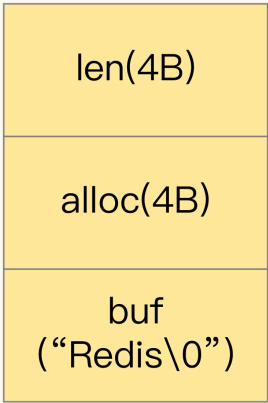

“实践篇”会用 5 节课的时间学习“数据结构”，涵盖：

- 节省内存开销
- 保存和统计海量数据的数据类型及其底层数据结构

并结合典型的应用场景（如地址位置查询、时间序列数据库读写和消息队列存取），介绍使用 Redis 的数据类型和 module 扩展功能来满足需求的具体方案。

这篇笔记讲解 String 类型的内存空间消耗问题，以及选择节省内存开销的数据类型的解决方案。 

先看一个需求。

假设要开发一个**图片存储系统**，要求能快速记录图片 ID 和图片在存储系统中保存时的 ID（图片存储对象 ID）。同时，还要能够根据图片 ID 快速查找到图片存储对象 ID。

因为图片数量巨大，所以可以采用 10 位数来表示图片 ID 和图片存储对象 ID，例如，图片ID 为 1101000051，它在存储系统中对应的 ID 号是 3301000051。

```go
photo_id: 1101000051   
photo_obj_id: 3301000051
```

可以看到，图片 ID 和图片存储对象 ID 正好一一对应，是典型的“键 - 单值”模式。

> 所谓“**单值**”，是指键值对中的值不是一个集合，这和 String 类型提供的“一个键对应一个值的数据”的保存形式刚好契合。

而且，**String 类型可以保存二进制字节流**，就像“万金油”一样，只要把数据转成二进制字节数组，就可以保存了。

所以设计**方案一**：用 String 保存数据。把图片 ID 和图片存储对象 ID 分别作为键值对的 key 和 value 来保存，其中，图片存储对象 ID 用了 String 类型。

开始保存 1 亿张图片，大约用掉 6.4GB 的内存。随着图片数据量的不断增加， Redis 内存使用量也在增加，很容易会遇到大内存 Redis 实例因为生成 RDB而响应变慢的问题。很明显，String 类型并不是一种好的选择，它明显的短板是保存数据时所消耗的内存空间较多，这是由它底层的数据结构决定的。因此还需要进一步寻找能节省内存开销的数据类型方案。

其实，集合类型的数据结构有非常节省内存空间的特点。但集合类型保存的数据模式，是一个键对应一系列值，并不适合直接保存单值的键值对。所以，可以使用**二级编码**的方法，实现用集合类型保存单值键值对，以降低 Redis 实例的内存空间消耗。

## 为什么 String 类型内存开销大？

刚才的案例中，保存 1 亿张图片的信息，用了约 6.4GB 的内存，一个图片 ID 和图片存储对象 ID 的记录平均用了 64 字节。

问题是一组图片 ID 及其存储对象 ID 的记录，实际只需要 16 字节就可以了：图片 ID 和图片存储对象 ID 都是 10 位数，可以用两个 8 字节的Long 类型表示这两个 ID。因为 8 字节的 Long 类型最大可以表示 2 的 64 次方的数值，所以肯定可以表示 10 位数。但是，为什么 String 类型却用了 64 字节呢？

其实，除了记录实际数据，String 类型还需要额外的内存空间记录数据长度、空间使用等信息，这些信息也叫作元数据。当实际保存的数据较小时，元数据的空间开销就显得比较大了，有点“喧宾夺主”的意思。

那么，String 类型具体是怎么保存数据的呢？

当保存 64 位有符号整数时，String 类型会把它保存为一个 8 字节的 Long 类型整数，这种保存方式通常也叫作 int 编码方式。

但是，当保存的数据中包含字符时，String 类型就会用简单动态字符串（SimpleDynamic String，SDS）结构体来保存，如下图所示：



- **buf**：字节数组，保存实际数据。为了表示字节数组的结束，Redis 会自动在数组最后加一个 `\0` ，这就会额外占用 1 个字节的开销。
- **len**：占 4 个字节，表示 buf 的已用长度。
- **alloc**：也占个 4 字节，表示 buf 的实际分配长度，一般大于 len。

可以看到，在 SDS 中，buf 保存实际数据，而 len 和 alloc 本身其实是 SDS 结构体的额外开销。

另外，对于 String 类型来说，除了 SDS 的额外开销，还有一个来自于 RedisObject 结构体的开销。

因为 Redis 的数据类型有很多，而且，不同数据类型都有些相同的元数据要记录（比如最后一次访问的时间、被引用的次数等），所以，Redis 会用一个 RedisObject 结构体来统一记录这些元数据，同时指向实际数据。

一个 RedisObject 包含了 8 字节的元数据和一个 8 字节指针，这个指针再进一步指向具体数据类型的实际数据所在，例如指向 String 类型的 SDS 结构所在的内存地址。


为了节省内存空间，Redis 还对 Long 类型整数和 SDS 的内存布局做了专门的设计。

一方面，当保存的是 Long 类型整数时，RedisObject 中的指针就直接赋值为整数数据了，这样就不用额外的指针再指向整数了，节省了指针的空间开销。

另一方面，当保存的是字符串数据，并且字符串小于等于 44 字节时，RedisObject 中的元数据、指针和 SDS 是一块连续的内存区域，这样可以避免内存碎片。这种布局方式也被称为 embstr 编码方式。

当然，当字符串大于 44 字节时，SDS 的数据量就开始变多了，Redis 就不再把 SDS 和RedisObject 布局在一起了，而是会给 SDS 分配独立的空间，并用指针指向 SDS 结构。这种布局方式被称为 raw 编码模式。


知道了 RedisObject 所包含的额外元数据开销，就可以计算 String 类型的内存使用量了。

因为 10 位数的图片 ID 和图片存储对象 ID 是 Long 类型整数，所以可以直接用 int 编码的 RedisObject 保存。每个 int 编码的 RedisObject 元数据部分占 8 字节，指针部分被直接赋值为 8 字节的整数了。此时，每个 ID 会使用 16 字节，加起来一共是 32 字节。但是，另外的 32 字节去哪儿了呢？

前面第二篇笔记说过，Redis 会使用一个全局哈希表保存所有键值对，哈希表的每一项是一个 dictEntry 的结构体，用来指向一个键值对。dictEntry 结构中有三个 8 字节的指针，分别指向 key、value 以及下一个 dictEntry，三个指针共 24 字节，如下图所示：


但是，这三个指针只有 24 字节，为什么会占用了 32 字节呢？这就要提到 Redis 使用的内存分配库 jemalloc 了。

jemalloc 在分配内存时，会根据申请的字节数 N，找一个比 N 大，但是最接近 N 的2 的幂次数作为分配的空间，这样可以减少频繁分配的次数。

举个例子。如果你申请 6 字节空间，jemalloc 实际会分配 8 字节空间；如果你申请 24 字节空间，jemalloc 则会分配 32 字节。所以，在刚刚说的场景里，dictEntry 结构就占用了 32 字节。

好了，到这儿，你应该就能理解，为什么用 String 类型保存图片 ID 和图片存储对象 ID 时需要用 64 个字节了。

你看，明明有效信息只有 16 字节，使用 String 类型保存时，却需要 64 字节的内存空间，有 48 字节都没有用于保存实际的数据。换算下，如果要保存的图片有 1 亿张，那么 1 亿条的图片 ID 记录就需要 6.4GB 内存空间，其中有 4.8GB 的内存空间都用来保存元数据了，额外的内存空间开销很大。那么，有没有更加节省内存的方法呢？

## 用什么数据结构可以节省内存？

Redis 有一种底层数据结构，叫压缩列表（ziplist），这是一种非常节省内存的结构。

压缩列表的构成：

- 表头有三个字段 zlbytes、zltail 和 zllen，分别表示列表长度、列表尾的偏移量，以及列表中的 entry 个数。
- 表尾还有一个 zlend，表示列表结束。


压缩列表之所以能节省内存，就在于它是用一系列连续的 entry 保存数据。每个 entry 的元数据包括下面几部分。

- **prev_len**，表示前一个 entry 的长度。prev_len 有两种取值情况：1 字节或 5 字节。取值 1 字节时，表示上一个 entry 的长度小于 254 字节。虽然 1 字节的值能表示的数值范围是 0 到 255，但是压缩列表中 zlend 的取值默认是 255，因此，就默认用 255表示整个压缩列表的结束，其他表示长度的地方就不能再用 255 这个值了。所以，当上一个 entry 长度小于 254 字节时，prev_len 取值为 1 字节，否则，就取值为 5 字节。
- **len**：表示自身长度，4 字节；
- **encoding**：表示编码方式，1 字节；
- **content**：保存实际数据。

这些 entry 会挨个儿放置在内存中，不需要再用额外的指针进行连接，这样就可以节省指针所占用的空间。

以保存图片存储对象 ID 为例，来分析一下压缩列表是如何节省内存空间的。

每个 entry 保存一个图片存储对象 ID（8 字节），此时，每个 entry 的 prev_len 只需要1 个字节就行，因为每个 entry 的前一个 entry 长度都只有 8 字节，小于 254 字节。这样一来，一个图片的存储对象 ID 所占用的内存大小是 14 字节（ 1 + 4 + 1 + 8 = 1 4  ），实际分配 16 字节。

Redis 基于压缩列表实现了 List、Hash 和 Sorted Set 这样的集合类型，最大好处就是节省了 dictEntry 的开销。使用 String 类型时，一个键值对就有一个 dictEntry，要用 32 字节空间。但采用集合类型时，一个 key 就对应一个集合的数据，能保存的数据多了很多，但也只用了一个 dictEntry，这样就节省了内存。

这个方案听起来很好，但还存在一个问题：在用集合类型保存键值对时，一个键对应了一个集合的数据，但是在我们的场景中，一个图片 ID 只对应一个图片的存储对象 ID，该怎么用集合类型呢？

换句话说，在一个键对应一个值（也就是单值键值对）的情况下，该怎么用集合类型来保存这种单值键值对呢？

## 如何用集合类型保存单值的键值对？

在保存单值的键值对时，可以采用基于 Hash 类型的**二级编码**方法。这里说的二级编码，就是把一个单值的数据拆分成两部分，前一部分作为 Hash 集合的 key，后一部分作为Hash 集合的 value，这样一来，我们就可以把单值数据保存到 Hash 集合中了。

以图片 ID 1101000060 和图片存储对象 ID 3302000080 为例，可以把图片 ID 的前7 位（1101000）作为 Hash 类型的键，把图片 ID 的最后 3 位（060）和图片存储对象ID 分别作为 Hash 类型值中的 key 和 value。

按照这种设计方法，在 Redis 中插入了一组图片 ID 及其存储对象 ID 的记录，并且用info 命令查看了内存开销，发现增加一条记录后，内存占用只增加了 16 字节，如下所示：

```bash
127.0.0.1:6379> info memory
# Memory
used_memory:1039120
127.0.0.1:6379> hset 1101000 060 3302000080
(integer) 1
127.0.0.1:6379> info memory
# Memory
used_memory:1039136
```

在使用 String 类型时，每个记录需要消耗 64 字节，这种方式却只用了 16 字节，所使用的内存空间是原来的 1/4，满足了节省内存空间的需求。

不过，你可能也会有疑惑：“二级编码一定要把图片 ID 的前 7 位作为 Hash 类型的键，把最后 3 位作为 Hash 类型值中的 key 吗？”其实，**二级编码方法中采用的 ID 长度是有讲究的**。

第 2 篇笔记介绍过 Redis Hash 类型的两种底层实现结构：**压缩列表**和**哈希表**。Hash类型设置了用压缩列表保存数据时的两个阈值，一旦超过了阈值，Hash 类型就会用哈希表来保存数据了。

这两个阈值分别对应以下两个配置项：

- **hash-max-ziplist-entries**：表示用压缩列表保存时哈希集合中的最大元素个数。  
- **hash-max-ziplist-value**：表示用压缩列表保存时哈希集合中单个元素的最大长度。

如果往 Hash 集合中写入的元素个数超过了 hash-max-ziplist-entries，或者写入的单个元素大小超过了 hash-max-ziplist-value，Redis 就会自动把 Hash 类型的实现结构由压缩列表转为哈希表。

一旦从压缩列表转为了哈希表，Hash 类型就会一直用哈希表进行保存，而不会再转回压缩列表了。在节省内存空间方面，哈希表就没有压缩列表那么高效了。

为了能充分使用压缩列表的精简内存布局，我们一般要控制保存在 Hash 集合中的元素个数。所以，在刚才的二级编码中，我们只用图片 ID 最后 3 位作为 Hash 集合的 key，也就保证了 Hash 集合的元素个数不超过 1000，同时把 hash-max-ziplist-entries 设置为 1000，这样一来，Hash 集合就可以一直使用压缩列表来节省内存空间了。

## 小结

这节课打破了对 String 的认知误区。

以前，我们认为 String 是“万金油”，什么场合都适用，但是，在保存的键值对本身占用的内存空间不大时（例如这节课里提到的的图片 ID 和图片存储对象 ID），String 类型的元数据开销就占据主导了，这里面包括了RedisObject 结构、SDS 结构、dictEntry 结构的内存开销。

针对这种情况，可以使用压缩列表保存数据。当然，使用 Hash 这种集合类型保存单值键值对的数据时，我们需要将单值数据拆分成两部分，分别作为 Hash 集合的键和值，就像刚才案例中用二级编码来表示图片 ID，希望你能把这个方法用到自己的场景中。

最后，我还想再给你提供一个小方法：如果你想知道键值对采用不同类型保存时的内存开销，可以在这个网址里输入你的键值对长度和使用的数据类型，这样就能知道实际消耗的内存大小了。建议你把这个小工具用起来，它可以帮助你充分地节省内存。

## 小测试

除了 String 类型和 Hash 类型，还有其他合适的类型可以应用在本篇笔记所说的保存图片的例子吗？

## 精选留言 (39)

**Katio**

保存图片的例子，除了用String和Hash存储之外，还可以用Sorted Set存储（勉强）。

Sorted Set与Hash类似，当元素数量少于zset-max-ziplist-entries，并且每个元素内存占用小于zset-max-ziplist-value时，默认也采用ziplist结构存储。我们可以把zset-max-ziplist-entries参数设置为1000，这样Sorted Set默认就会使用ziplist存储了，member和s…

**Wangxi**

实测老师的例子，长度7位数，共100万条数据。使用string占用70mb，使用hash ziplist

只占用9mb。效果非常明显。redis版本6.0.6

**geek1185**

老师能否讲解一下hash表这种redis数据结构，底层在用压缩列表的时候是如何根据二级的键找到对应的值的呢。是一个entry里会同时保存键和值吗

**慎独明强**

看了Redis设计与实现，有讲SDS这一块，对于老师分析的内容，自己心里有印象，再结合  
老师今天的实践案例，前面的知识还没有吃透  

**zhou**

hset 1101000 060 3302000080  

这条记录只消耗 16 字节没明白，压缩列表保存一个对象需要 14 字节，060、3302000080 都需要保存，那应该至少大于 28 字节

**阳明**

请问老师，在我们设置hash-max-ziplist-entries为1000的时候，这样每次使用hget查询的时候耗时是不是会增加? 因为压缩列表的查询时间复杂度为O(N)，现在是把N提高到了1000

**test**

虽然压缩列表可以节约内存，但是set和get的时间复杂度为O(N)，一个时间换空间的方法。

**蓝魔、**

老师，测试环境：redis5.0.4

1.实践采用String方案：set 1101000052 3301000051，查看内存增加的72，而不是64，是为什么？

2.实践采用Hash方案：hset 1101000 060 3302000080 查看内存增加88，再次添加key-value，才是满足增加16

**小喵喵**

老师，请教下，这样拆分的话，如何重复了咋办呢？

以图片 ID 1101000060 和图片存储对象 ID 3302000080 为例，我们可以把图片 ID 的前7 位（1101000）作为 Hash 类型的键，把图片 ID 的最后 3 位（060）和图片存储对象 ID 分别作为 Hash 类型值中的 key 和 value。

比如：两张图片分别为：图片 ID 1101000060 图片存储对象 ID 3302000080；

作者回复: 我们是会把图片 ID 的前7位作为键值对的key，Hash集合是键值对的value，在你举的例子中，图片ID 1101000060和1101001060。它们的前7位分别是1101000和1101001，对应了两个键值对。所以，它们图片ID的后3位虽然相同，都是060，也是在两个Hash集合中的，不会冲突的。

你看看是不是呢？

**伟伟哦**

老师今天讲的可以给个代码，配置了选项 如何实现把图片 ID 的最后 3 位（060）和图片存储对象 ID 分别作为 Hash 类型值中的 key 和 value。 代码操作下

**MClink**

老师，底层数据结构的转换是怎么实现的呢？是单纯的开一个新的数据结构再把数据复制过去吗？再释放之前的数据结构的内存，复制过程中有修改值的话要怎么处理，复制过程中不就两倍内存消耗了

**小白**

通过老师的文章学到很多，但是有个小建议，一样把文章中的图片都标一下序号，评论区讨论问题时方便引用。有个疑问，RedisObject是占用16byte，SDS结构体的头部len和alloc分别占总4byte,buff字节数组结尾固定占用1byte，那embstr的临界值不应该是64byte-16byte-4byte-4byte-1byte $=$ 39byte吗，为啥会是44byte？

**super BB**

老师，我之前看到《redis设计与实现》中提出SDS 的结构体的中没有alloc字段，书中的提到的是free,用来表示buf数组未使用的字节长度

作者回复: 学习的很仔细！

《Redis设计与实现》这本书分析的代码是Redis3.0的源码，在Redis3.0.4源码中，SDS结构体里还是用的free表示未使用空间。

但是应该差不多是Redis3.2.0开始，SDS结构体开始使用alloc字段了。

**P先生**

redis为什么要使用SDS呢？原因如下：对比 C 字符串， sds 有以下特性：  

可以高效地执行长度计算（strlen）；

可以高效地执行追加操作（append）；

二进制安全；

...

**注定非凡**

一，作者讲了什么？

Redis的String类型数据结构，及其底层实现

二，作者是怎么把这事给说明白的？

1，通过一个图片存储的案例，讲通过合理利用Redis的数据结构，降低资源消耗

**子非鱼**

为啥只增了16字节，图片 ID 的前 7 位作为 Hash 类型的键这个不是也要占用空间么

**楼下小黑哥**

有一个问题，hset 1101000 060 3302000080 命令，应该将键 entry 与值的 entry 都增加到了压缩列表，那为什么内存增加大小仅仅是 值 entry 的大小那？

做了下实验，同一个 hash 键的前提下，设置值，比如 hset 1101000 160 3302000080有时候内存大小不变。

但是有时候内存增加不止 16 ，碰到过 24，也有 32，有点疑惑。…

**篮球不是这么打的**

老师你好，我想知道用压缩列表的新方案后，内存是节省了，那有没有带来什么缺点呢？

**欧雄虎(Badguy）**

老师我这边用redis5.0.9测试。hset 1101000 060 3302000080之后内存不止增加16，老师帮忙看下是我这边的测试方法不对吗？测试方法如下！

[root@redis02 src]# ./redis-cli 127.0.0.1:6379> info memory

**yyl**

“在节省内存空间方面，哈希表就没有压缩列表那么高效了”

在内存空间的开销上，也许哈希表没有压缩列表高效

但是哈希表的查询效率，要比压缩列表高。

在对查询效率高的场景中，可以考虑空间换时间

...

作者回复: 其实，在Redis的设计和使用上，是一个典型的“系统”思维，也就是权衡（trade-off），根据自己的业务场景、数据量、访问特征，来进行选择。  
我们自己做系统研发，这是个核心思想 ：）