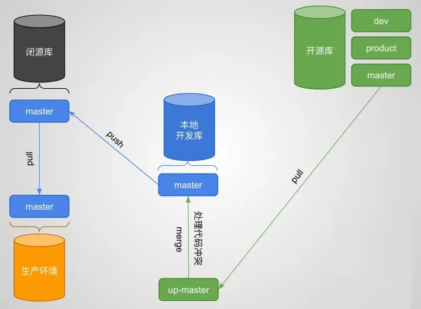

## 1.使用多个远端仓库协作开发

自己从0开发项目的时候，一个项目对应一个git仓库，而且经常就一个master分支，这种情况很简单。

但如果需要用一个大型开源项目作为项目起点，之后自己开发的部分提交到另一个私有库，同时需要和开源项目保持更新同步，情况就复杂一些。

我肯定不是第一个遇到这样问题的人。

梳理一下：我需要从一个开源库拉取代码，合并，开发，提交到私有库，并且不断重复这个过程推进私有库项目，流程图如下：



如图所示的逻辑已被我运用到实际开发中。简要说明一下：

1. 私有库只有一个master分支；
2. 本地开发库有两个分支master和up-master，分别绑定私有库和开源库的master分支。

开源库的分支有很多，使用master分支可以获得及时更新的代码。当然也可以选择product之类的分支来追求更稳定的代码，这个根据实际情况来定。

以上是理论模型，下面从零开始一步步实现。

### 1.1 创建私有库备用

登录[https://github.com/new](https://link.zhihu.com/?target=https%3A//github.com/new)新建一个私有项目，这里就不做更多描述。

### 1.2 初始化本地项目

```shell
cd workdir
mkdir my_project_name
cd my_project_name
git init
```

这样我们就在my_project_name目录下新建了一个空的git项目。

### 1.3 添加远程仓库到本地

我们现在有两个远程仓库，一个是刚刚创建的私有仓库，另一个是开源仓库。

```shell
# 添加私有仓库，别名为 origin
(main) git remote add origin https://github.com/easelify/my_project_name.git

# 添加开源仓库，别名为 upstream
(main) git remote add upstream https://开源库地址
```

### 4.创建本地分支并和远端分支绑定

```shell
# 拉取开源库(upstream)的main分支到本地
(main) git fetch upstream main
# 此时本地工作目录是空的, 检出到 upstream/main
(main) git checkout main

# 在本地创建up-main分支并将工作目录切换到此分支
(main) git checkout -b up-main

# 将本地的up-main分支和开源库(upstream)的main分支绑定
(up-main) git branch -u upstream/main

# 将本地工作目录切换回main分支
(up-main) git checkout main

# 将本地main分支推送到私有库(origin)
# 即实现本地main分支和origin/main分支的绑定
(main) git push -u origin main
```

通过上面的操作，我们的分支有了如下的对应关系：

main ===> origin/main

up-main===> upstream/main

### 5.定期拉取upstream/main代码合并到本地main分支

```shell
# 切换到up-main分支
(main) git checkout up-main

# 拉取代码, 注意一定要先切换到up-main分支
(up-main) git pull upstream main

# 切换到main分支
(up-main) git checkout main

# 将 up-main 的代码合并到 main 分支
(main) git merge up-main
```

合并分支的时候如果出现代码冲突，有冲突的文件会被git标红, 通过 git status 可以看到未解决冲突的文件列表，手动解决完这些冲突后再执行 git add 和 commit 进行一次常规的提交即可。

本文所述的案例中，我们没有权限向开源仓库(upstream)提交代码，也没有这个需求，只需要定期更新代码并且合并到我们自己的项目即可。

如果觉得开源项目有需要改进的地方可以单独fork修改后提交pull request, 这不在本文的讨论范围了。其实也可以直接在main分支修改，只是这是私有化的代码，如果你想改进开源项目还是要提交pull request的。

### 6.生产环境的代码部署

直接拉取私有库的main分支即可，本文为了方便叙述和理解只有一个mainr分支，在实际的应用中，可能会有dev, prod等分支，按需设定，按需取用即可。

至此开篇提出的需求完美解决，庆幸的是开源库更新非常快，使我有机会测试合并代码。

### 7.其他同事加入开发

本文是以全新的空仓库开始的，如果有新同事加入项目，操作流程会稍有改变。不需要第2步 git init 初始化空项目了，直接 git clone 私有库地址即可，第3步也只需要添加远端的开源库了，后面的流程一样。

### 8.直接编辑git的配置文件

上面我们都是通过一系列终端命令行来操作git项目配置的，如果你熟悉git的配置可以进入项目根目录下的 .git 目录，直接编辑config文件，本文项目的完整配置文件如下：

```bash
[core]
  repositoryformatversion = 0
  filemode = true
  bare = false
  logallrefupdates = true
  ignorecase = true
  precomposeunicode = true
[remote "origin"]
  url = https://github.com/easelify/my_project_name.git
  fetch = +refs/heads/*:refs/remotes/origin/*
[remote "upstream"]
  url = http://开源库地址
  fetch = +refs/heads/*:refs/remotes/upstream/*
[branch "master"]
  remote = origin
  merge = refs/heads/master
[branch "up-master"]
  remote = upstream
  merge = refs/heads/master
[pull]
  ff = only
```

### 9. 二进制文件冲突的解决

文本冲突可以直接编辑解决，如果是二进制文件，比如图片发生冲突的时候，使用以下命令选择保留哪一个文件。

```bash
# 使用 --ours 参数保留当前分支版本的文件
git checkout --ours /path/to/file

# 使用 --theirs 参数保留并入分支版本的文件
git checkout --theirs /path/to/file
```

### 10. git常用命令设置

```bash
# 全局配置 - 别名
git config --global alias.co checkout
git config --global alias.br branch
git config --global alias.ci commit
git config --global alias.st status
```

配置别名后，可以用别名替代原有命令，可以少敲几个字母，例如可以使用 git st 代表 git status了，还是方便不少的，因为这些命令用到的频率实在太高了。

```bash
# 全局配置 - 提交和日志输出的字符集编码
git config --global i18n.commitencoding utf-8
git config --global i18n.logoutputencoding utf-8

# 设置当前终端的less命令使用utf-8编码
export LESSCHARSET=utf-8
```

在 Linux 下通过 git log 查看提交日志的时候，中文无法正常显示，配置上述编码后可正常显示中文。