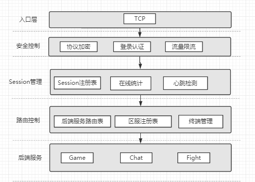
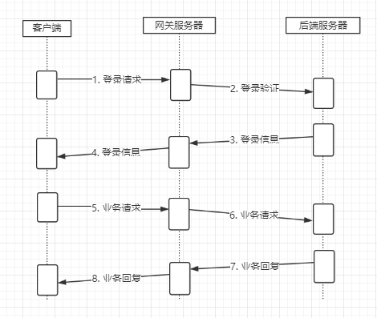

# 前言

​	进入一家游戏公司进行一款卡牌游戏后端的开发，主程给我看的第一部分代码就是网关服务器。由于之前对这块儿一直都是一知半解，查阅相关资料后，这里记录一下重新学习的过程。

# 网关

## 1.1任务简介

​	网关服在游戏服务器架构中充当着十分重要的角色，他用来隔离游戏客户端与服务器。在不同类型的项目中承担的功能也不太一样，主要的功能有以下几种：

1. 压缩：压缩本身是一件比较耗时的操作，放在网关中可以减轻游戏压力；
2. 过滤：过滤主要是识别非正式请求，保护后端服务；
3. 转发：转发是保证客户端消息准确快速到达目标地址，
4. 加密：加密来提高客户端与服务器之间通信安全。

​	这篇文章主要就是从转发的角度来介绍一下网关服相应的技术。

​	先来聊一聊网关服转发的任务描述：客户端（比如用unity编写的游戏客户端）与具体后端服务器之间进行的消息交互，是通过网关服转发来实现的。客户端与网关服通过TCP链接，网关服将客户端消息发送到对应的服务器（登录服、广场服、游戏服），对应服务器收到消息之后进行处理，处理完再通过网关服将消息发送给客户端。网关服也可以对消息进行校验，防止恶意攻击。

​	简而言之，网关服用于维持玩家客户端与具体后端服务器之间的连接，将玩家发送的游戏请求转发到具体的后端服务器。

## 1.2功能特性

​	网关服需要有一些功能特性来支撑他的运行，基础特性有以下四种：

1. 对外开放：客户端需要知道网关的IP和端口，才能连接上来；
2. 统一入口：架构中可能存在很多后端服务，如果没有一个统一的入口，则客户端需要知道每个后端服务的IP和端口；
3. 请求转发：由于统一了入口，所以网关必须能将客户端的请求转发到准确的服务上；
4. 无感更新：由于玩家链接的是网关服务器，只要链接不断，更新后端服务器对玩家来说是无感知的，或者感知很少（根据实现的方式不同）。

​	一般来讲，有了以上四个特性，这个网关就可以使用了，那我们为什么不使用Nginx做网关，而是要自己开发呢？

因为除了以上四个基础特性，网关服还需要具备以下特殊功能：

1. session认证：网关需要能够维护客户端是否登录成功的状态，对于未登录的请求，不予以转发，从而预防恶意攻击；
2. 流量限流：游戏经常会遇到DDOS攻击，一个客户端通过一个for循环一直向后端服务发送请求，所以必须进行限制；
3. 踢下线：游戏维护时，为了让玩家能更新补丁，会将玩家踢下线，重新走一遍登录流程，避免客户端与服务端的数据不一致，造成显示上的bug。此外也需要经常对一些违规的玩家进行踢下线处理；
4. 在线统计：网关有所有玩家的连接信息，所以可以轻松统计当前有多少玩家在线；
5. 协议加密：为了避免客户端的恶意攻击，需要将请求进行加密，由于统一了入口，所以网关做起来非常容易；
6. 心跳检测：用于检测客户端是否已经掉线，一般超过几分钟没有收到心跳请求，则认为客户端已经掉线，直接请求登陆数据，让玩家重新走登录流程。

​	集成以上功能之后，便形成了以下网关服务的架构图：

​	需要一提的是，这张图中的路由控制，会根据不同游戏类型有所变动，其中：

1. 后端服务路由表：维护了后端当前有哪些服务注册到网关了，以及服务对应哪些区服的配置信息；
2. 区服注册表：维护了当前开了哪些区服以及区服信息；
3. 终端管理：所有连接上网关的设备或进程都被认为是一个终端，终端会有一个编号，这个编号对应后端服务编号或者玩家编号。当需要转发消息给后端服务或客户端时，就需要从终端管理中找到具体的连接进行消息发送。

## 1.3分步流程

​	客户端、网关服务器、后端服务器之间的分步流程如下：

​	分步解析：

​	step1：客户端连接网关服务器，然后发送登录请求给网关；

​	step2：网关直接将登录请求转发给对应区服的后端服务器进行登录验证；

​	step3：后端服务器验证成功后，会返回登陆信息给网关；

​	step4：网关会根据登录信息维持一个session映射，用于安全验证和重登判断，然后转发登录信息给客户端；

​	step5：客户端收到登陆成功消息后，就可以发送业务请求给网关了；

​	step6：网关收到业务请求后，会先判断玩家是否登录过，登录过的才转发给后端服务器，并且在协议头增加玩家标记；

​	step7：后端服务器收到业务请求后，根据协议头的玩家标记，找到玩家的数据进行业务处理，然后返回给网关；

​	step8：网关收到业务回复后，直接返回给客户端。

## 1.4交互细节

​	上面一章简单分步介绍了网关连接客户端与后端服务器的工作过程，下面来具体讨论一下连接转发过程中的一些细节.

### 1.4.1客户端与网关服

​	客户端与网关服的消息交互过程分为以下几个阶段：

1. 首先网关服要能够成功启动；
2. 客户端通过TCP连接网关服；
3. 网关服网络层收到连接之后，将连接消息发送给GatewayServerCenter::OnAccept；
4. 网关服应用层收到连接之后，判断连接IP是否被限制，若限制断开该连接，未限制则会new CClientProxy，并与当前连接对象进行绑定。新建的客户端代理对象会在其构造函数中将自己添加到GatewayServerCenter用户对象记录中进行管理；
5. 客户端发给网关服的消息会通过网络层转发给与之对应的客户端代理对象——CClientProxy；
6. 网关服发送给客户端的消息通过客户端代理对象——CClientProxy，发送给客户端。

​	注：

- GatewayClient：负责网关服与某一个服务器之间消息交互。一个GatewayClient对应多个ClientProxy；
- ClientProxy：一个玩家用于和某个服务器消息交互。网关服每收到一个客户端连接会创建一个CClientProxy，CClientProxy负责接收该客户端消息并转发到对应服务器。CClientProxy中包含有三个ClientToServerProxy对象分别用于续传消息发送给登录服、广场服、游戏服。

### 1.4.2网关服消息转发

​	网关服收到客户端请求之后，需要将消息转发给对应的后端服务器，过程如下：

1. 客户端和网关服建立连接；

2. 网关服通过CClientProxy与对应的客户端进行消息交互；

3. 以客户端将消息发送给登录服（游戏服、广场服流程一样）为例，网关服的客户端代理服务收到客户端消息之后，对消息头进行解析，此时消息是需要发送到登录服，网关服查找登录服信息并且随机选择其中一个；

4. 网关服将消息发送给随机选择的登录服，如果网关服和选中的登录服还未连接，则先连接再发送；

   上述过程需要说明的是，登录服通过服务器类型进行查找，数量可以有很多个；广场服也是通过服务器类型进行查找，且数量只能有一个；游戏服通过服务器id进行查找，玩家只能进某个具体的游戏服。

5. 登录服通过网关服将消息转发给客户端。

### 1.4.3网关服与后端服务器

​	网关服与后端服务器的交互过程如下：

1. 网关服开启前会先和中心服务器进行连接；
2. 后端服务器（登录服、广场服、游戏服）启动前会与中心服进行连接，连接成功之后，后端服务器会将基本信息发送给中心服务器。中心服务器收到基本信息之后，会将基本信息广播给所有已经与中心服务器连接的终端（包括网关服和后端服务器）；
3. 网关服收到中心服发送过来的后端服务器信息，并记录该信息；
4. 客户端发送消息给网关服务器，网关服需要将消息转发给对应服务器，当需要转发的服务器未与网关服连接，网关服会先和对应服务器进行连接（前提是网关服收到了中心服发送过来的该服务器信息），再将消息转发给对应后端服务器。
5. 后端服务器处理请求之后，再将消息经过网关服转发给客户端。

# Q&A

Q：如果有多个网关服务器，客户端怎么知道要连接哪个网关服务器呢？网关服务器的IP配置都写在客户端吗？

A：两种解决方案：

1. 在网关之前放一个负载均衡器，对外只暴露一个地址，通过负载均衡选择一个最终的网关；
2. 每个网关绑定一个区服，客户端在连接网关之前需要获取服务器列表，这个列表中的每个服务器都有一个网关地址，选择一个区服登录就可以登录对应的网关了。

Q：网关服务器架构设计复杂，那他能带来哪些优点呢？

A：主要有以下几点好处：

1. 作为网络通信的中转站，负责将内网和外网隔离开，使外部无法直接访问内部服务器，保障内网服务器的安全，一定程度上减少外挂的攻击；
2. 网关服务器负责解析数据包、加解密、超时处理和一定逻辑处理，这样可以提前过滤掉错误包和非法数据包；
3. 客户端程序只需建立与网关服务器的连接即可进入游戏，无需与其他服务器同时建立多条连接，节省了客户端和服务器程序的网络资源开销；
4. 在玩家跳服务器时，不需要断开与网关服务器的连接，玩家数据在不同游戏服务器间的切换是内网切换，切换工作瞬间完成，玩家几乎察觉不到，这保证了游戏的流畅性和良好的用户体验。

​	当然网关服务器架构也不是完美的，需要注意以下两个可能导致负面效果的情况：

1. 如何避免网关服务器成为高负载情况下的通讯瓶颈问题；
2. 由于网关的单节点故障导致整组服务器无法对外提供服务的问题。

​	上述两个问题都可以采用“多网关”技术加以解决。顾名思义，“多网关”就是同时存在多个网关服务器，比如一组服务器可以配置三台GameGate。当负载较大时，可以通过增加网关服务器来增加网关的总体通讯流量，当一台网关服务器宕机时，它只会影响连接到本服务器的客户端，其他客户端不会受到任何影响。

# 相关链接

[游戏服务器架构系列 - 网关协议加密 - 简书 (jianshu.com)](https://www.jianshu.com/p/26b6f417413a)

[游戏服务器架构系列 - 网关服务 - 简书 (jianshu.com)](https://www.jianshu.com/p/fcf60d64c6c9)

[游戏服务器——网关服_行走-CSDN博客_网关服](https://blog.csdn.net/nie2314550441/article/details/106006522)