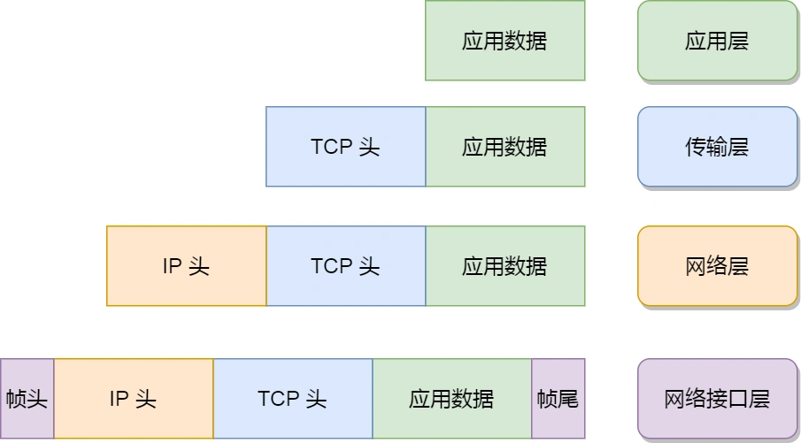

## 前言

同一台设备、进程之间的通信，可以通过**管道**、**消息队列**、**共享内存**、**信号**等方式来实现；而不同设备上的进程间通信，则需要**网络通信**。

设备是多样的，要兼容各种设备，就需要协商出一套**通用的网络协议**。这个网络协议是**分层**的，每一层有各自的作用和职责。

## 1.应用层

我们能直接接触到的就是应用层，它位于整个`TCP/IP网络模型`的最上层。电脑或手机应用软件都在应用层中实现。当两个不同设备的应用需要通信的时候，应用就把数据传给下一层传输层。

所以，应用层只需要专注于为用户提供应用功能。

应用层协议有：HTTP、FTP、Telnet、DNS、SMTP等。

应用层不关心数据如何传输，好比寄快递的时候，只需要把包裹交给快递员，我们并不关心他们如何运输快递。

**应用层是工作在操作系统中的用户态，传输层及以下则工作在内核态**。

## 2.传输层

应用层的数据包会传给**传输层**（Transport Layer），它为应用层提供**网络支持**。


传输层有两个协议：`TCP`和`UDP`：

- **TCP**：**传输控制协议**（*Transmission Control Protocol*），大部分应用使用的是TCP协议。TCP具备很多特性：**流量控制**、**超时重传**、**拥塞控制**等，目的是为了保证数据包能**可靠**的传输给对方。
- **UDP**：相对简单，只负责发送数据包，不保证数据包能抵达对方。它实时性相对更好，传输效率更高。UDP也可以实现可靠传输，把TCP的特性在应用层上实现就可以，不过实现一个商用可靠的UDP传输协议并不简单。

如果应用需要传输的数据非常大（超过`MSS`TCP最大报文长度），直接传输就不好控制，此时就需要将数据包**分块**。这样即使中途有分块丢失或损坏，只需重新发送这一个分块即可。

TCP协议把每个分块称为一个`TCP段`（TCP Segment）。


设备作为接收方时，传输层负责把数据包传给应用。但是一台设备上可能会有很多应用程序在接收或者传输数据，因此需要用**端口**将应用区分开来。

比如80端口通常是web服务器用的，22端口通常是远程登录服务器用的。对于浏览器（客户端）中的每个标签栏，都是一个独立的进程，操作系统会为这些进程分配临时端口号。

传输层的报文中会携带端口号，接收方可以因此识别出该报文发送给哪个应用。

注意，**传输层并不负责将数据从一个设备传输到另一个设备**。

现实中的网络错综复杂，中间有各种线路和分岔。一个设备的数据要传输给另一个设备，需要在各种各样的节点和路径之间进行选择。这块儿功能如果交由传输层负责，就有违设计原则了，因为传输层的设计理念是**简单**、**高效**、**专注**。

也就是说，我们不希望传输层协议处理太多的事情，只需要服务好应用即可，让其作为应用间数据传输的媒介，帮助实现应用到应用的通信，而实际的传输功能交给下一层：网络层。

## 3.网络层


网络层最常用的是`IP协议`（*Internet Protocol*），它将传输层的报文作为数据部分，加上IP包头组装成**IP报文**，如果IP报文大小超过`MTU`(以太网中一般为1500字节)就会再次进行分片，得到一个即将发送到网络的IP报文。


**网络层负责将数据从一个设备传输到另一个设备**。世界上那么多设备，该如何找到对方呢?为此，网络层需要区分设备的编号。

一般用**ip地址**给设备编号。对于 IPv4协议，IP地址共32位，分成了4段（例如192.168.100.1），每段是8位。只有一个单纯的 IP地址 虽然做到了区分设备，但是寻址起来特别麻烦。全世界那么多台设备，一个一个去匹配显然不科学。

因此，需要将 IP 地址分成两种意义：

- **网络号**：负责标识该IP地址是属于哪个**子网**的；
- **主机号**：—负责标识**同一子网下的不同主机**。

怎么分的呢？这需要配合**子网掩码**才能算出IP地址的网络号和主机号。

比如 `10.100.122.2/24`，后面的 `/24` 表示 `255.255.255.0` 子网掩码，255.255.255.0 二进制是 [11111111-11111111-11111111-00000000]，正是24个1。为了简化子网掩码的表示，用 /24 代替255.255.255.0。

之后，**将 IP地址 和 子网掩码 进行按位与运算，就可以得到网络号**：

```go
IP地址：10.100.122.2
	00001010 01100100 01111010 00000010
子网掩码：255.255.255.0
	11111111 11111111 11111111 00000000
// IP地址和子网掩码做AND运算
网络号：10.100.122.0
	00001010 01100100 01111010 00000000
```

**将子网掩码取反后与 IP地址进行按位与运算，就可以得到主机号**：

```go
IP地址：10.100.122.2
	00001010 01100100 01111010 00000010
子网掩码：255.255.255.0
	11111111 11111111 11111111 00000000
// 子网掩码取反，再与IP地址做AND运算
取反：0.0.0.255
	00000000 00000000 00000000 11111111
主机号：0.0.0.2
	00000000 00000000 00000000 00000010
```

可借助[子网掩码计算器](https://iiis.tsinghua.edu.cn/ip/)来理解上述计算过程。

在寻址过程中，先匹配到相同的网络号（找到同一个子网），再去找对应的主机。

除了**寻址能力**，IP协议还有另一个重要的能力就是**路由**。现实中，两台设备是通过很多网关、路由器、交换机等众多网络设备连接起来的，会形成很多条网络的路径。当数据包到达一个网络节点，就需要通过路由算法决定下一步走哪条路径。

**路由器寻址工作，就是找到目标地址的子网，进而把数据包转发给对应的网络内**。


所以，IP协议的寻址作用，是告诉我们去往下一个目的地该朝哪个方向走，路由则是根据下一个目的地选择路径。**寻址更像是在导航，路由更像是在操作方向盘**。

## 4.网络接口层

生成了 IP 头部之后，接下来要交给**网络接口层**（*Link Layer*），在 IP 头部的前面加上 **mac 头部**，并封装成**数据帧**（Data frame）发送到网络上。


互联网中，主要依据IP地址进行寻址，但在以太网的世界（局域网）中，这个思路是行不通的。

>  **以太网**
>
>  电脑上的以太网接口、wifi接口、以太网交换机、路由器上的千兆、万兆以太网口，还有网线，他们都是以太网的组成部分。以太网就是在一种`局域网`内，把附近的设备连接起来，是他们之间可以进行通信的技术。

**局域网（LAN）**中的数据通信是基于数据链路层的MAC地址进行的。所以，在以太网进行通讯要用到mac地址。

mac头部是以太网使用的头部，包含了接收方和发送方的mac地址等信息，我们可以通过ARP协议获取对方的mac地址。

所以说，网络接口层主要是为网络层提供**链路级别**传输的服务，负责在以太网、wifi这样的底层网络上发送原始数据包，工作在网卡这个层次，使用mac地址来标识网络上的设备。

## 5.总结

综上所述，TCP/IP 网络通常是由上到下分成4层，分别是`应用层`、`传输层`、`网络层`和`网络接口层`。


每一层的封装格式如下：



网络接口层的传输单位是帧（frame），ip层的传输单位是包（packet），tcp层的传输单位是段(segment)，http的传输单位是消息或报文（message）。这些名词并没有什么本质的区分，可以统称为**数据包**。