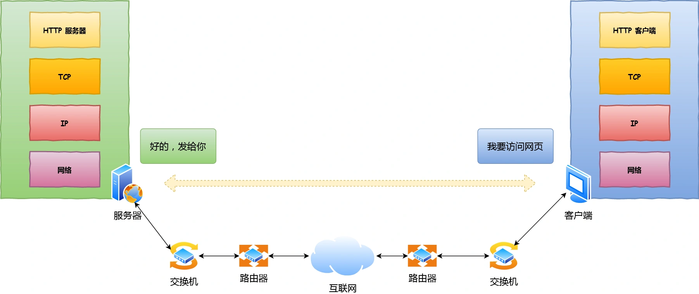

>  键入网址后，到网页显示期间，都发生了什么？



## 1. 孤单小弟——HTTP

### 1.1解析URL

浏览器做的第一步工作是对 URL 进行解析：


所以图中的 URL 实际上是请求服务器里的文件资源。

当没有路径名时（省略图中的蓝色部分 URL 元素），就代表访问根目录下事先设置的**默认文件**，也就是 `/index.html` 或者`/default.html`这些文件。

### 1.2生成 HTTP 请求

对 URL 解析之后，浏览器确定了Web服务器和文件名，就根据这些信息来生成 HTTP 请求。


> 孤单的 HTTP 数据包说：我这么一个小小的数据包，无亲无故，直接发送到浩瀚的网络，谁会知道我呢？谁会载我一程呢？谁能保护我呢？我的目的地在哪呢?
>
> 充满各种疑问的它，没有停滞不前，依然踏上了征途！

## 2.真实地址查询——DNS

浏览器解析 URL 并生成 HTTP 消息后，就要委托**操作系统**，将消息发送给 Web 服务器。

但在发送之前，还需要先**查询服务器域名对应的 IP 地址**。因为委托操作系统发送消息时，必须提供通信对象的 IP 地址。

比如我们打电话的时候，必须要知道对方的电话号码，但由于电话号码难以记忆，所以通常我们会将对方电话号 + 姓名 保存在通讯录里。

所以，有一种服务器专门保存了 web 服务器域名与 ip 的对应关系，它就是 dns 服务器。

### 2.1域名的层级关系

dns 中的域名都是用句点来分割的，比如 `www.baidu.com`，这里的句点代表了不同层次之间的界限。

在域名中，**越靠右**的位置表示其**层级越高**。

毕竟域名是外国人发明的，思维与中国人相反。比如说一个城市地点的时候，外国喜欢从小到大的顺序说起（xx街道xx区xx市xx省），而中国喜欢从大到小的顺序（xx省xx市xx区xx街道）。

实际上域名最后还有一个点，比如`www.baidu.com.`，最后这个点代表**根域名**。

所以域名的层级关系类似一个树状结构：

- 根 DNS 服务器（`.`）
- 顶级域 DNS 服务器（`.com`）
- 权威 DNS 服务器（`server.com`）


根域的DNS服务器信息保存在互联网中所有的DNS服务器中，任何DNS服务器就都可以找到并访问根域DNS服务器。

因此，客户端只要能够找到任意一台DNS服务器，就可以通过它找到根域DNS服务器，然后再一路顺藤摸瓜找到位于下层的某台目标DNS服务器。

### 2.2域名解析工作流

1. 客户端首先发出一个DNS请求，问 `www.baidu.com`的 IP是啥，并发给**本地 DNS服务器**，也就是客户端的TCP/IP设置中填写的DNS服务器地址；
2. 本地域名服务器收到客户端的请求后，如果缓存里的表格能找到 `www.baidu.com`，则直接返回IP地址。如果没有，本地DNS会去问它的**根域名服务器**。根域名服务器是最高层次的，不直接用于域名解析，但能指明一条道路；
3. 根DNS收到来自本地DNS的请求后，发现后置是`.com`，说，`www.baidu.com`这个域名归`.com`区域管理，我给你`.com`顶级域名服务器的地址，你去问它；
4. 本地DNS收到顶级域名服务器的地址后，发起请求：sir，能告诉我 `www.baidu.com`的IP地址吗？
5. **顶级域名服务器**说，我给你负责`www.baidu.com`区域的权威DNS服务器的地址，你去问它；
6. 本地DNS于是转向问**权威DNS服务器**，brother，`www.baidu.com`对应的ip是啥？`baidu.com`的权威DNS服务器，它是域名解析结果的原出处。为啥叫权威呢？因为我的域名我做主。
7. 权威DNS服务器查询后，将对应的 IP 地址 `x.x.x.x`告诉本地DNS；
8. 本地DNS再将IP地址返回给客户端，客户端和目标建立连接。

至此，整个DNS的解析过程就完成了：


DNS 域名解析的过程蛮有意思的，整个过程和日常生活中找人问路的过程类似，只指路不带路。

当然，并不是每次解析域名都要经过这么多步骤吗，缓存可以提高解析效率：

1. **浏览器**会先看自身有没有对这个域名的缓存，如果有，就直接返回；如果没有，就去问操作系统。
2. **操作系统**查看自己的缓存，如果有，就直接返回；如果没有，再去hosts文件看；
3. **hosts文件**也没有，才会去问**本地DNS服务器**。

> 数据包表示：DNS老大哥厉害，找到了目的地了！可我还是很迷茫呀，我要发出去，接下来我需要谁的帮助呢？

## 3.指南好帮手——协议栈

通过DNS(应用层协议)获取到IP之后，可以把HTTP的传输工作交给操作系统中的**协议栈**。

协议栈的内部分为几个部分，分别承担不同的工作。上下关系有一定规则的：上面的部分会向下面的部分委托工作，下面的部分收到委托工作并执行。


应用程序（浏览器）通过**调用Socket库，来委托协议栈工作**。

协议栈的上半部分有两块，分别是负责收发数据的TCP和UDP协议，这两个传输协议会接受应用层的委托，执行收发数据的操作。

协议栈的下半部分是用IP协议控制网络包收发操作，在互联网上传数据时，数据会被切成一块块的网络包，而将网络包发送给对方的操作就是由IP负责的。

此外IP中还包括`ICMP`协议和`ARP`协议：

- `ICMP`用于告知网络包传送过程中产生的错误以及各种控制信息。
- `ARP`用于根据IP地址查询相应的以太网MAC地址。

IP下面的**网卡驱动程序负责控制网卡硬件**，而最下面的**网卡则负责完成实际的收发操作**，也就是对网线中的信号执行发送和接收操作。

> 数据包看了这份指南表示：原来我需要那么多大佬的协助啊！那我先去找找TCP大佬！

## 4.可靠传输——TCP

HTTP是基于TCP协议传输的，我们来了解一下TCP协议。

### 4.1TCP报文头部


首先，**源端口号**和**目标端口**是必不可少的。有了它们，数据才知道应该发送给哪个应用。

接着是包的**序号**，这个是为了解决**包乱序**的问题。

然后是应该有的**确认号**，目的是确认发出去的包，对方是否收到。如果没有就重新发送，直至送达。这个是为了解决**丢包**的问题。

接着还有一些**状态位**，例如`SYN`是发起一个链接，`ACK`是回复，`RST`是重新连接，`FIN`是结束连接等。TCP是面向连接的，因而双方要维护连接的状态。这些**带状态位的包的发送，会引起双方的状态变更**。

还有一个重要的内容是**窗口大小**。TCP要做**流量控制**，通信双方各自声明一个窗口（缓存大小），标识当前自己能够处理的能力，别发送的太快，消化不了，也别发的太慢，等的饿肚子。

除了做流量控制外，TCP还会做**拥塞控制**，网络堵不堵，它无能为力，唯一能做的就是控制自己，也即控制发送的速度——不能改变世界，那就改变自己。

### 4.2TCP三次握手

数据传输之前，需要先建立连接，这个过程通常称为**三次握手**。

所谓“连接”，是指双方计算机里维护一个状态机，连接建立的过程中，双方的状态变化时序图如下：


过程解析：

- 一开始，客户端和服务端都处于`CLOSE`状态。首先服务端主动监听某个端口，处于`LISTEN`状态；
- 然后客户端主动发起连接 `SYN`，之后处于 `SYN-SENT` 状态。
- 服务端收到发起的连接，返回 `SYN`，并且 `ACK` 客户端的 `SYN`，之后处于 `SYN-RCVD` 状态。
- 客户端收到服务端发送的 `SYN` 和 `ACK` 之后，发送对 `SYN` 确认的 `ACK`，之后处于 `ESTABLISHED` 状态，因为它一发一收成功了。
- 服务端收到 `ACK` 的 `ACK` 之后，处于 `ESTABLISHED` 状态，因为它也一发一收了。

所以三次握手的目的是**保证双方都有发送和接收的能力**。

### 4.3如何查看TCP的连接状态？

`Linux`可以通过 `netstat -napt`命令查看：


### 4.4TCP分割数据

如果 HTTP 请求消息比较长，超过了 `MSS` 的长度， TCP 就会把 HTTP 的数据拆块发送：


- `MTU`：一个网络包的最大长度，以太网中一般为 `1500` 字节。
- `MSS`：除去 IP 和 TCP 头部之后，一个网络包所能容纳的 TCP 数据的最大长度。

数据会以 `MSS` 的长度为单位进行拆分，拆出来的每块数据都会被放进单独的网络包中，加上 TCP 头信息，然后交给 IP 模块来发送。


### 4.5TCP报文生成

TCP 协议里面会有两个端口：

- **源端口号**：浏览器监听的端口，通常随机生成；
- **目的端口号**：Web 服务器监听的端口，HTTP 默认是 `80`， HTTPS 默认是 `443`。

在双方建立了连接后，TCP 报文中的**数据部分**存放 HTTP 头部 + 数据。

至此，网络包的报文如下图：


组装好 TCP 报文之后，就需交给下面的网络层处理。

> 此时，遇上了 TCP 的 数据包激动表示：太好了，碰到了可靠传输的 TCP 传输，它给我加上 TCP 头部，安全感十足啊！有大佬可以保护我的可靠送达！但我应该往哪走呢?

## 5.远程定位——IP

TCP模块在执行连接、收发、断开等各阶段操作时，都需要委托IP模块将数据封装成**网络包**发送给通信对象。

### 5.1IP包头


IP协议里面需要有两个地址：

- **源地址IP**：客户端输出的IP地址；
- **目标地址**：通过DNS域名解析得到的Web服务器IP。

HTTP是经过TCP传输的，所以IP包头的协议号，要填写为`06(十六进制)`，表示协议为TCP。

> 假设客户端有多个网卡，就会有多个IP地址，那IP头部的源地址应该选择哪个IP呢?

这个问题等同于在多块网卡中选择使用哪块网卡来发送包，需要借助**路由表规则**来判断。

linux系统中，可以使用`route -n`命令查看当前系统的路由表。

```sh
lsx_hp@localhost:~$ route -n
Kernel IP routing table
Destination     Gateway         Genmask         Flags Metric Ref    Use Iface
192.168.3.0     0.0.0.0         255.255.255.0   U     0      0        0 eth0
192.168.10.0    0.0.0.0         255.255.255.0   U     0      0        0 eth1
0.0.0.0         172.19.0.1      0.0.0.0         UG    0      0        0 eth0
```

举个例子，根据上面的路由表，假设web服务器的目标地址是`192.168.10.200`：


1. 首先和第一条目的子网掩码（Genmask）进行`与运算`，得到结果为 `192.168.10.0`，但是第一个条目的 `Destination` 是 `192.168.3.0`，两者不一致所以匹配失败。
2. 再与第二条目的子网掩码进行 **与运算**，得到的结果为 `192.168.10.0`，与第二条目的 `Destination 192.168.10.0` 匹配成功，所以将使用 `eth1` 网卡的 IP 地址作为 IP 包头的源地址。

假设 Web 服务器的目标地址是 `10.100.20.100`，依然依照上面的路由表规则判断，判断后的结果是和第三条目匹配。

第三条目比较特殊，它的目标地址和子网掩码都是 `0.0.0.0`，表示`默认网关`，如果其他所有条目都无法匹配，就会自动匹配这一行，并且后续就把包发给路由器，`Gateway` 即是路由器的 IP 地址。

### 5.2IP报文

至此，网络包的报文如下图：


> 加上了 IP 头部的数据包表示 ：“感谢 IP 大佬给我加上了 IP 包头，让我有了远程定位的能力！可是目的地好远啊，我下一站应该去哪呢？”

## 6.两点传输——MAC

生成了 IP 头部之后，接下来网络包还需要在 IP 头部的前面加上 `MAC 头部`。

### 6.1MAC包头

MAC 头部是以太网使用的头部，它包含了接收方和发送方的 MAC 地址等信息。


在 MAC 包头里需要**发送方 MAC 地址**和**接收方目标 MAC 地址**，用于**两点之间的传输**。

一般在 TCP/IP 通信里，MAC 包头的`协议类型`只使用：

- `0800` ： IP 协议
- `0806` ： ARP 协议

> MAC 发送方和接收方如何确认?

`发送方`的 MAC 地址获取比较简单，生产网卡时已经写入到 ROM 里了，只要将这个值读出来写入到 MAC 头部就行。

`接收方`的 MAC 地址相对复杂，我们需要告诉以太网对方的 MAC 的地址，以太网才会帮我们把包发送过去。首先接收方的IP地址我们是可以拿到的——通过查阅**路由表**。在路由表中找到相匹配的条目，**Gateway 列**中的 IP 地址就是接收方的IP地址。

> 知道了IP地址，如何获取对方的 MAC 地址呢？

喊呗！ `ARP` 协议可以帮我们找到路由器的 MAC 地址。


ARP 协议会在以太网中以`广播`的形式，对以太网所有的设备喊出：“这个 IP 地址是谁的？请把你的 MAC 地址告诉我”。

然后就会有人回答：“这个 IP 地址是我的，我的 MAC 地址是 XXXX”。

如果对方和自己处于同一个子网中，那么通过上面的操作就可以得到对方的 MAC 地址。然后，我们将这个 MAC 地址写入 MAC 头部，MAC 头部就完成了。

> 好像每次都要广播获取，这不是很麻烦吗？

非也。后续操作系统会把本次查询结果放到一块叫做 **ARP 缓存**的内存空间留着以后用，不过缓存的时间就几分钟。

也就是说，在发包时：

- 先查询 ARP 缓存，如果其中已经保存了对方的 MAC 地址，就不需要发送 ARP 查询，直接使用 ARP 缓存中的地址。
- 而当 ARP 缓存中不存在对方 MAC 地址时，则发送 ARP 广播查询。

> 查看 ARP 缓存内容

 Linux 中可以使用 `arp -a` 命令来查看 ARP 缓存的内容：

```sh
lsx_hp@localhost:~$ arp -a
1 (172.19.0.1) at 00:15:5d:2a:48:ec [ether] on eth0
      IP地址             MAC地址                网口名称
```

6.2MAC 报文

至此，网络包的报文如下图：


> 此时，加上了 MAC 头部的数据包万分感谢，说道 ：“感谢 MAC 大佬，我知道我下一步要去哪了！我现在有很多头部兄弟，相信我可以到达最终的目的地！”。 带着众多头部兄弟的数据包，终于准备要出门了。

## 7.出口——网卡

网络包只是存放在内存中的一串二进制数字信息，没有办法直接发送给对方。因此，我们需要将**数字信息**转换为**电信号**，才能在网线上传输，这才是真正的数据发送过程。

负责执行这一操作的是**网卡**，要控制网卡还需要**网卡驱动程序**。

网卡驱动获取网络包之后，会将其复制到网卡内的**缓存区**中，接着会在其`开头`加上`报头`和`起始帧分界符`，在`末尾`加上用于检测错误的`帧校验序列`。


- **起始帧分界符**是一个用来表示包起始位置的标记;
- 末尾的 `FCS`（**帧校验序列**）用来检查包传输过程是否有损坏。

最后电信号会通过网线发送出去。

> 真是不容易！至此，一个带有许多头部的数据终于踏上寻找目的地的征途了！

## 8.送别者——交换机

下面来看一下包是如何通过交换机的。交换机的设计是将网络包`原样`转发到目的地。交换机工作在 MAC 层，也称为`二层网络设备`。

> 交换机的包接收操作

首先，电信号到达网线接口，交换机里的模块进行接收，接下来交换机将电信号转换为数字信号。

然后通过包末尾的 `FCS` 校验错误，如果没问题则放到缓冲区。这部分操作基本和计算机的网卡相同，但交换机的工作方式和网卡不同。

计算机的**网卡本身具有 MAC 地址**，并通过核对收到的包的接收方 MAC 地址判断是不是发给自己的，如果不是发给自己的则丢弃；而交换机的端口不核对接收方 MAC 地址，而是直接接收所有的包并存放到缓冲区中。因此，**交换机的端口不具有 MAC 地址**。

将包存入缓冲区后，接着查询这个包的接收方 MAC 地址是否已经在 **MAC 地址表**中有记录了。

交换机的 MAC 地址表主要包含两个信息：

- 一个是设备的 MAC 地址，
- 另一个是该设备连接在交换机的哪个端口上。


举个例子，如果收到的包的接收方 MAC 地址为 `00-02-B3-1C-9C-F9`，则与图中表中的第 3 行匹配，根据端口列的信息，可知这个地址位于 `3` 号端口上，然后就可以通过交换电路将包发送到相应的端口了。

所以，`交换机根据 MAC 地址表查找 端口列，然后将信号发送到相应的端口`。

> MAC 地址表找不到指定的 MAC 地址会怎么样？

地址表中找不到指定的 MAC 地址。可能是因为：

1. 具有该地址的设备还没有向交换机发送过包；
2. 这个设备一段时间没有工作导致地址被从地址表中删除了。

这种情况下，交换机无法判断应该把包转发到哪个端口，只能将包转发到除了源端口之外的所有端口上，无论该设备连接在哪个端口上都能收到这个包。

这样做不会产生什么问题，以太网的设计本来就是将包发送到整个网络的，**只有相应的接收者才接收包，而其他设备则会忽略这个包**。

可这样做会发送多余的包，会不会造成网络拥塞呢？

其实不用过于担心。发送了包之后目标设备会作出响应，只要返回了响应包，交换机就可以将它的地址写入 MAC 地址表，下次也就不需要把包发到所有端口了。

局域网中每秒可以传输上千个包，多出一两个包并无大碍。

此外，如果接收方 MAC 地址是一个**广播地址**，那么交换机会将包发送到除源端口之外的所有端口。

以下两个属于广播地址：

- MAC 地址中的 `FF:FF:FF:FF:FF:FF`
- IP 地址中的 `255.255.255.255`

> 数据包通过交换机转发抵达了路由器，准备要离开土生土长的子网了。此时，数据包和交换机离别时说道：“感谢交换机兄弟，帮我转发到出境的大门，我要出远门啦！”

## 9.出境大门——路由器

> 路由器与交换机的区别

网络包经过交换机之后，现在到达了`路由器`，并在此被转发到下一个路由器或目标设备。

这一步转发的工作原理和交换机类似，也是通过查表判断包转发的目标。

不过在具体的操作过程上，路由器和交换机是有区别的。

- `路由器是基于 IP 设计的`，俗称`三层网络设备`，路由器的各个端口都具有 MAC 地址和 IP 地址；
- `交换机是基于以太网设计的`，俗称`二层网络设备`，交换机的端口不具有 MAC 地址。

> 路由器基本原理

路由器的端口具有 MAC 地址，因此它就能够成为以太网的发送方和接收方；同时还具有 IP 地址，从这个意义上来说，它和计算机的网卡是一样的。

当转发包时，首先路由器端口会接收发给自己的以太网包，然后`路由表`查询转发目标，再由相应的端口作为发送方将以太网包发送出去。

> 路由器的包接收操作

首先，电信号到达网线接口部分，路由器中的模块会将电信号转成数字信号，然后通过包末尾的 `FCS` 进行错误校验。

如果没问题则检查 MAC 头部中的`接收方 MAC 地址`，看看是不是发给自己的包，如果是就放到接收缓冲区中，否则就丢弃这个包。

总的来说，路由器的端口都具有 MAC 地址，只接收与自身地址匹配的包，遇到不匹配的包则直接丢弃。

> 查询路由表确定输出端口

完成包接收操作之后，路由器就会`去掉`包开头的 MAC 头部。

`MAC 头部的作用就是将包送达路由器`，其中的接收方 MAC 地址就是路由器端口的 MAC 地址。因此，当包到达路由器之后，MAC 头部的任务就完成了，于是 MAC 头部就会被丢弃。

接下来，路由器会根据 MAC 头部后方的 `IP` 头部中的内容进行包的转发操作。

转发操作分为几个阶段，首先是查询`路由表`判断转发目标。


具体的工作流程根据上图，举个例子。

假设地址为 `10.10.1.101` 的计算机要向地址为 `192.168.1.100` 的服务器发送一个包，这个包先到达图中的路由器。

判断转发目标的第一步，就是根据包的接收方 IP 地址查询路由表中的目标地址栏进行**路由匹配**：每个条目的**子网掩码**和 **目标 IP** 做 **与运算**，得到的结果与对应条目的目标地址进行匹配，如果匹配就会作为候选转发目标，如果不匹配就继续与下个条目进行路由匹配。

如第二条目的子网掩码 `255.255.255.0` 与 `192.168.1.100` IP 做 `& 与运算`后，得到结果是 `192.168.1.0` ，这与第二条目的目标地址 `192.168.1.0` 匹配，该第二条目记录就会被作为转发目标。

实在找不到匹配路由时，就会选择`默认路由`，路由表中子网掩码为 `0.0.0.0` 的记录表示「默认路由」。

> 路由器的发送操作

接下来就会进入包的**发送**。

首先，我们需要根据`路由表的网关列`判断对方的地址。

- 如果网关是一个 IP 地址，则这个IP 地址就是我们要转发到的目标地址，`还未抵达终点`，还需继续需要路由器转发。
- 如果网关为空，则 IP 头部中的接收方 IP 地址就是要转发到的目标地址，也是就终于找到 IP 包头里的目标地址了，说明`已抵达终点`。

知道对方的 IP 地址之后，接下来需要通过 `ARP` 协议根据 IP 地址查询 MAC 地址，并将查询的结果作为接收方 MAC 地址。

路由器也有 ARP 缓存，因此首先会在 ARP 缓存中查询，如果找不到则发送 ARP 查询请求。

接下来是发送方 MAC 地址字段，这里填写输出端口的 MAC 地址。还有一个以太类型字段，填写 `0800` （十六进制）表示 IP 协议。

网络包完成后，接下来会将其转换成电信号并通过端口发送出去。这一步的工作过程和计算机也是相同的。

发送出去的网络包会通过`交换机`到达下一个路由器。由于接收方 MAC 地址就是下一个路由器的地址，所以交换机会根据这一地址将包传输到下一个路由器。

接下来，下一个路由器会将包转发给再下一个路由器，经过层层转发之后，网络包就到达了最终的目的地。

不知你发现了没有，在网络包传输的过程中，`源 IP `和`目标 IP` 始终是不会变的，一直变化的是 MAC 地址，因为**需要 MAC 地址在以太网内进行两个设备之间的包传输**。

> 数据包通过多个路由器道友的帮助，最终抵达了目的地的城门！城门值守的路由器，发现了这个小兄弟数据包原来是找城内的人，于是就将数据包送进了城内，再经由城内的交换机帮助下，最终转发到了目的地了。数据包感慨万千的说道：“多谢这一路上，各路大侠的相助！”

## 10.互相扒皮——服务器与客户端

数据包终于抵达了服务器，服务器高兴的不得了，于是开始扒数据包的皮！就好像你收到快递，能不兴奋吗？


服务器会先扒开数据包的 MAC 头部，查看是否和服务器自己的 MAC 地址符合，符合就将包收起来。

接着扒开数据包的 IP 头，发现 IP 地址符合，根据 IP 头中协议项，知道自己上层是 TCP 协议。

于是，扒开 TCP 的头，里面有序列号，需要看一看这个序列包是不是我想要的，如果是就放入缓存中，然后返回一个 ACK，如果不是就丢弃。TCP 头部里面还有端口号， HTTP 的服务器正在监听这个端口号。

于是，服务器自然就知道是 HTTP 进程想要这个包，于是就将包发给 HTTP 进程。

服务器的 HTTP 进程看到，原来这个请求是要访问一个页面，于是就把这个网页封装在 HTTP 响应报文里。

HTTP 响应报文也需要穿上 TCP、IP、MAC 头部，不过这次是源地址是服务器 IP 地址，目的地址是客户端 IP 地址。

穿好头部衣服后，从网卡出去，交由交换机转发到出城的路由器，路由器就把响应数据包发到了下一个路由器，就这样跳啊跳。

最后跳到了客户端的城门把守的路由器，路由器扒开 IP 头部发现是要找城内的人，于是又把包发给了城内的交换机，再由交换机转发到客户端。

客户端收到了服务器的响应数据包后，同样也非常的高兴，客户能拆快递了！

于是，客户端开始扒皮，把收到的数据包的皮扒剩 HTTP 响应报文后，交给浏览器去渲染页面，一份特别的数据包快递，就这样显示出来了！

最后，客户端要离开了，向服务器发起了 TCP 四次挥手，至此双方的连接就断开了。

## 11.Q&A

> 笔记本的是自带交换机的吗?交换机现在我还不知道是什么?

笔记本不是交换机，交换机通常是2个网口以上。

现在家里的路由器其实有了交换机的功能了。交换机可以简单理解成一个设备，三台电脑网线接到这个设备，这三台电脑就可以互相通信了，交换机嘛，交换数据这么理解就可以。

> 我弄不清楚路由器和交换机有什么区别，可以跟我解释一下吗？

当涉及到网络设备时，路由器和交换机都是常见的组件，它们都是用于连接计算机和其他设备的网络设备，但是它们的功能和用途不同。

**路由器是一种网络设备，它用于将两个或多个不同网络连接在一起**，以便它们可以相互通信。路由器具有路由功能，它可以将来自一个网络的数据包转发到另一个网络。当你连接到互联网时，你的路由器会将你的数据包发送到互联网上的其他设备，使你可以访问互联网上的其他计算机和服务。路由器还可以提供网络安全功能，如防火墙、端口转发和VPN等。

另一方面，**交换机也是一种网络设备，它用于在同一网络中连接多个设备**，如计算机、服务器、打印机等。交换机具有交换功能，它可以在不同设备之间传输数据包。当你在局域网中发送数据时，数据包会通过交换机直接发送到目标设备，而不需要经过路由器。交换机可以提高网络性能和速度，因为它可以直接将数据包传输到目标设备，而不是像路由器那样需要将数据包发送到另一个网络。

总的来说，路由器和交换机都是网络设备，但是它们的功能和用途不同。路由器用于连接不同的网络，而交换机用于连接同一网络中的多个设备。

> 如果知道你电脑的 Mac 地址，我可以直接给你发消息吗?

不可以直接给另外一台电脑发送消息，只知道MAC地址并不足以建立通信。MAC地址是一个用于识别网络设备的唯一标识符，但是它只在局域网内有用(两个设备之间传递使用)。要建立通信，你需要知道另一台电脑的IP地址，以及使用适当的通信协议和应用程序来发送和接收消息。

如果你知道另一台电脑的IP地址，你可以使用网络聊天应用程序或邮件客户端等工具来发送消息。但请注意，发送未经请求的消息或骚扰信息是不被允许的，可能会违反法律法规或网络服务提供商的使用条款。

> 公网服务器的 Mac 地址是在什么时机通过什么方式获取到的?我看 ARP 获取 Mac 地址只能获取到内网机器的 Mac 地址吧?

在发送数据包时，如果目标主机不是本地局域网，填入的 MAC 地址是路由器，也就是把数据包转发给路由器，路由器一直转发下一个路由器，直到转发到目标主机的路由器，发现目标 IP 地址是自己局域网内的主机，就会 ARP 请求获取目标主机的 MAC 地址，从而转发到这个服务器主机。

转发的过程中，源 IP 地址和目标 IP 地址是不会变的（前提：没有使用 NAT 网络的），源 MAC 地址和目标 MAC 地址是会变化的。
